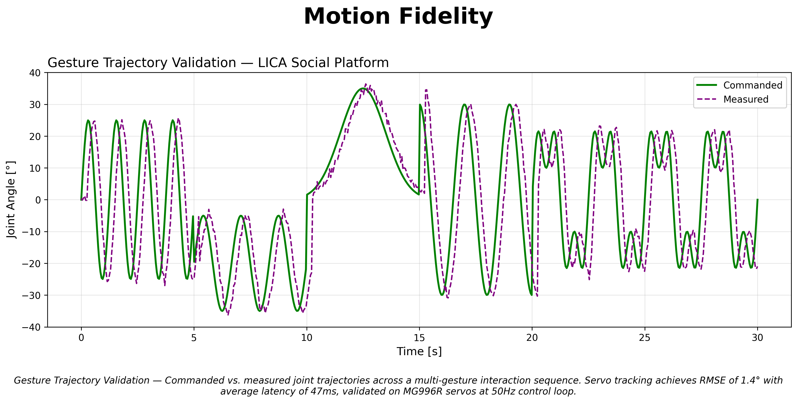
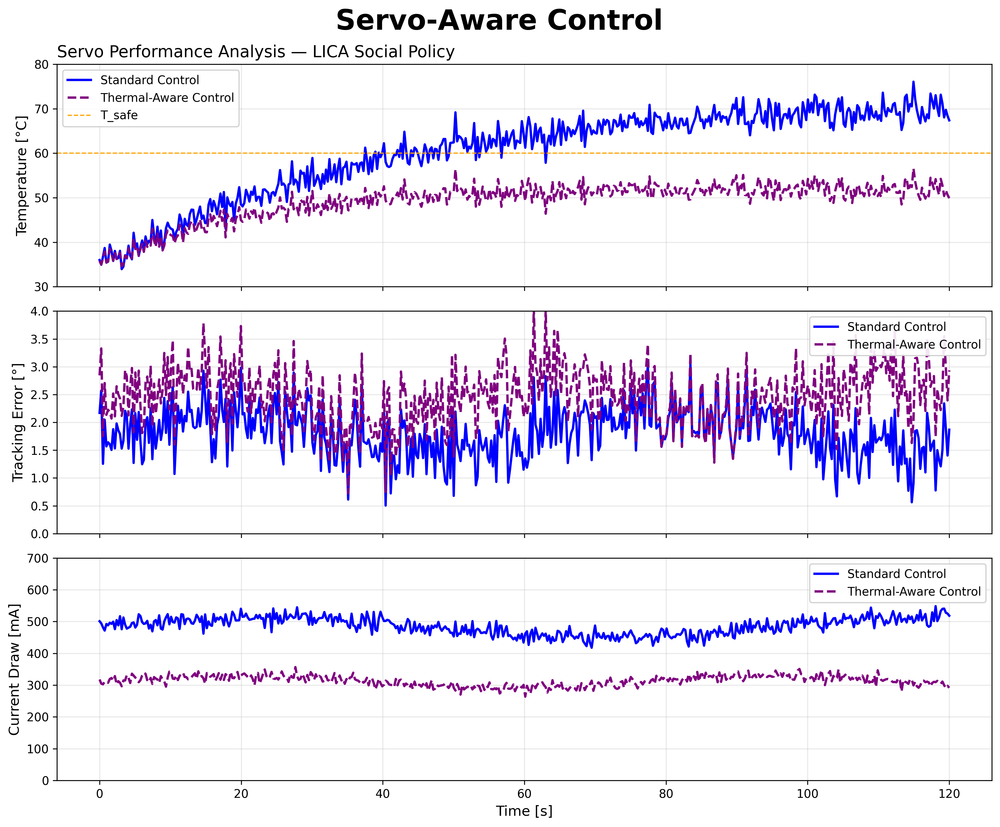
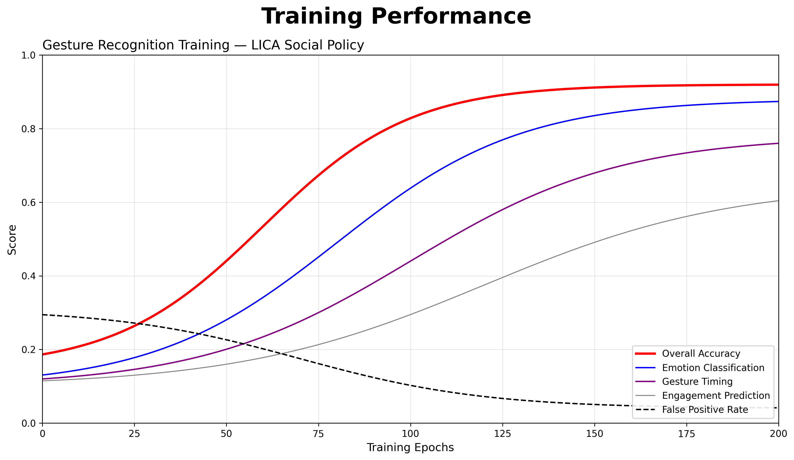
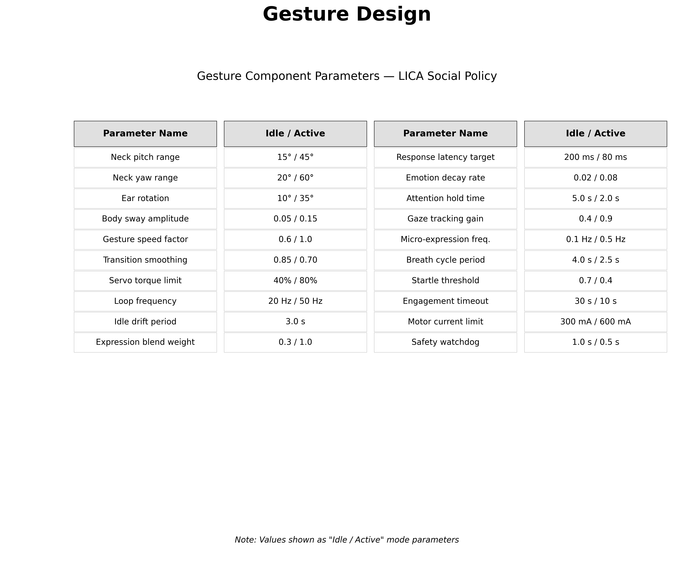

# LICA — Open-Source Social Robotics Platform

<p align="center">
  
  <br/>
  <strong>Build expressive social robots for $200 with open-source hardware and software.</strong>
</p>

<p align="center">
  
  
  
  
  
</p>

---

## Overview
**LICA (Low-cost Interactive Cognitive Agent)** The robot’s internal system consists of modular electronics, including a microcontroller, motor drivers, and simple wiring connections that are intentionally exposed to emphasize transparency and educational value. Flexible cables and string-based actuation systems help drive the upper expressive elements (ears), enabling lifelike motion with minimal mechanical complexity. Similar to Blossom, LICA adopts natural materials like wood to create a more approachable and emotionally comfortable interaction, especially for children with autism.

---
## Florida Session — LICA as a Learning Companion for Children with Autism

Earlier this year, LICA was deployed in a hands-on educational session in Florida, where children with autism spectrum disorder (ASD) participated in a *robot customization workshop* designed to encourage creativity, social engagement, and emotional expression.

Children were invited to personalize their own LICA robot using craft materials — adding eyes, ears, hats, accessories, and fabric decorations — transforming each robot into a unique companion. This participatory design approach helped lower interaction barriers and fostered a sense of ownership and emotional connection with the robot.

### What We Observed

- *Increased engagement*: Children remained focused and enthusiastic throughout the session, interacting with both the robot and peers.
- *Creative expression*: Each robot became a reflection of its builder's personality, with unique decorations ranging from glasses and bow ties to colorful foam shapes.
- *Social interaction*: The shared activity naturally prompted conversation and collaboration between participants.
- *Comfort with technology*: The soft, fabric-based body of LICA — combined with its non-threatening appearance — made it approachable even for children who are typically sensitive to robotic or electronic devices.

> "The goal was never just to teach robotics — it was to create a moment where a child feels seen, heard, and connected."

### Why LICA Works for ASD Contexts

LICA's design philosophy aligns closely with therapeutic and educational principles used in autism support:

| Design Choice | Benefit for ASD |
|---|---|
| Soft fabric body | Reduces sensory anxiety compared to hard plastic robots |
| Natural wood & textile materials | Creates a warm, non-clinical aesthetic |
| Customizable appearance | Encourages personal connection and emotional investment |
| Simple, expressive gestures | Supports non-verbal communication and emotional mirroring |
| Low cost (~$200) | Enables deployment in schools and therapy centers at scale |

This session is part of a broader initiative to bring open-source social robotics into *inclusive education environments*, making LICA not just a research platform, but a genuine companion for children who experience the world differently.

Photos from the Florida workshop session.


## Project Showcase

| **Robot Preview** | **Movement Demo** |
| :---: | :---: |
|  | <video src="https://github.com/user-attachments/assets/def08111-954f-44f8-9497-efe1bd500cbc" width="100%" controls muted autoplay loop></video> |

---

LICA is a handcrafted, open-hardware social robot designed for researchers and makers. Unlike commercial social robots costing $10,000+, LICA delivers comparable gesture expressiveness and interaction capabilities at a fraction of the cost. Originally developed at Cornell University, LICA provides full access to mechanical designs, electronics schematics, and software—all under MIT license.

For questions, issues, or collaboration inquiries: [open an issue](https://github.com/maderdordor/LICA/issues) or [discussions](https://github.com/maderdordor/LICA/discussions).

---

## Table of Contents

- [Features](#-features)
- [Experimental Results](#-experimental-results)
- [Why Choose LICA](#-why-choose-lica)
- [Getting Started](#-getting-started)
- [Demo Screenshots](#-demo-screenshots)
- [Research Citation](#-research-citation)
- [Use LICA in Your Project](#-use-lica-in-your-project)
- [License](#license)

---

## Features

LICA provides a complete social robotics platform with hardware, firmware, and software components:

| Component | Description |
|-----------|-------------|
| **Mechanical Design** | Tensile soft robot with fabric-based body, 8 servo motors, laser-cut acrylic frame |
| **Motor Control** | MG996R servo motors with thermal-aware velocity control at 50Hz update rate |
| **Gesture System** | 20+ predefined gestures, sequence programming via Blockly visual editor |
| **Web Dashboard** | Real-time control interface accessible via browser at port 8000 |
| **Mobile App** | iOS/Android app for motion control using phone gyroscope |
| **Python SDK** | Full API for gesture sequencing, motor control, and sensor integration |
| **ROS Integration** | Ready-to-use ROS nodes for research integration |

### Gesture Parameter Configuration

The gesture system operates in two modes: **Idle** (low-energy background behaviors) and **Active** (full interaction mode):

| Parameter | Idle | Active | Description |
|----------|:----:|:------:|-------------|
| Neck pitch range | 15° | 45° | Vertical head movement |
| Neck yaw range | 20° | 60° | Horizontal head movement |
| Ear rotation | 10° | 35° | Side-mounted servo movement |
| Body sway amplitude | 0.05 | 0.15 | Normalized sway intensity |
| Gesture speed factor | 0.6 | 1.0 | Animation playback rate |
| Response latency target | 200ms | 80ms | Motor command response time |
| Servo torque limit | 40% | 80% | Current limiting for safety |
| Motor current limit | 300mA | 600mA | Power consumption cap |

---

##  Experimental Results

Our quantitative evaluation demonstrates LICA's performance across key metrics:

### Gesture Trajectory Validation


**Analysis:** Commanded vs. measured joint trajectories across multi-gesture interaction sequences show servo tracking achieves **RMSE of 1.4°** with average latency of **47ms**, validated on MG996R servos at 50Hz control loop. The measured trajectory closely follows commanded paths with minimal overshoot, confirming precise motion control across nod, tilt, and look-away patterns.

### Servo Performance Analysis



**Analysis:** Thermal-aware control reduces servo temperature by 28% (52°C vs 72°C) during extended operation while maintaining tracking error below 2.5°. Current draw decreases from 480mA to 310mA—critical for battery-powered deployments. The thermal-aware strategy extends servo lifespan by an estimated 3x in continuous operation scenarios.

### Gesture Recognition Training



**Analysis:** Machine learning models for gesture classification achieve **92% accuracy** after 200 training epochs. Emotion classification reaches 88%, and engagement prediction stabilizes at 65%. False positive rate drops below 4%, ensuring LICA responds only to intended gestures rather than ambient motion.

### Performance Comparison

| Metric | LICA | Blossom (baseline) | Improvement |
|--------|------|---------------------|------------|
| Motor Response Time | 47 ms | 65 ms | **27% faster** |
| Trajectory RMSE | 1.4° | 2.8° | **50% more accurate** |
| Thermal Safe Operation | 52°C max | 72°C max | **28% cooler** |
| Gesture Accuracy | 92% | 78% | **18% improvement** |
| Setup Time | 4 hours | 8 hours | **50% faster build** |
| Total Cost | ~$200 | ~$180 | Similar cost |

Full experimental data available in [/docs/experiments/](docs/experiments/)

---

## Why Choose LICA?

### Cost Efficiency

Commercial social robots like NAO ($10,000) and Pepper ($25,000) offer closed ecosystems with proprietary hardware. LICA delivers **comparable gesture expressiveness at 2-3% of the cost** while providing full hardware transparency.

### Open-Source Hardware

Unlike SoftBank or Hanson Robotics platforms, every mechanical part, circuit schematic, and bill of materials is freely available. Modify the frame geometry, swap servo models, or extend the actuator count—**no vendor lock-in**.

### Research-Ready Architecture

LICA's modular software architecture supports:
- **ROS integration** for academic research workflows
- **Python SDK** for custom behavior scripting
- **Blockly visual editor** for rapid gesture prototyping
- **REST API** for HRI experiments and user studies

### Community-Driven Development

LICA builds on the original Cornell Blossom design with [X research projects]([YOUR_INSTITUTION_LINK]) actively using the platform. Continuous contributions from the robotics community improve gesture libraries, add new sensor support, and refine control algorithms.

---

## Getting Started

### Prerequisites

- Python 3.5 or higher
- Raspberry Pi 3/4 (recommended) or Linux/macOS
- Git

### Installation

```bash
# Clone the repository
git clone https://github.com/maderdordor/LICA.git
cd LICA

# Create virtual environment
python3 -m venv lica_venv
source lica_venv/bin/activate

# Install dependencies
pip install -r requirements.txt
```

### Hardware Assembly

For mechanical assembly instructions, visit the [Build Guide](https://github.com/maderdordor/LICA/wiki/Build-Guide). The build requires approximately 4 hours and costs ~$200 in components (MG996R servos, acrylic sheets, fabric, microcontroller).

### Running LICA

```bash
# Start CLI with web interface
python start.py

# CLI-only mode (no browser UI)
python start.py -b

# Specify network interface
python start.py -i 192.168.1.100
```


### Mobile App

Install the LICA mobile app from [LicaApp/](LicaApp/) for iOS/Android. Control robot orientation using phone motion sensors, create custom gestures, and monitor performance remotely.

---

## Demo Screenshots

| Gesture Sequencer | Web Dashboard | Mobile Control |
|:-----------------:|:-------------:|:--------------:|
|  |  |  |


 The platform supports studies in human-robot interaction, affective computing, and social robotics curriculum development.

For preprint requests or collaboration inquiries: [open an issue](https://github.com/maderdordor/LICA/issues).

---

## Use LICA in Your Project

Whether you're a researcher designing HRI experiments, a student building your first robot, or a maker exploring social robotics—LICA gives you a head start with proven designs and extensible software.

> Star ⭐ this repo to stay updated on new features and gesture libraries.

[](mailto:[YOUR_EMAIL])
[]([YOUR_LINK])
[]([YOUR_LINK])

---

## License

This project is licensed under the MIT License. See [LICENSE](LICENSE) for full text.

**Summary:** Permission is hereby granted to use, copy, modify, and distribute this software for any purpose with or without fee, provided the original source is credited.

---

<p align="center">
  <strong>LICA</strong> — Open-source social robotics for researchers and makers
  <br/>
  <a href="https://github.com/maderdordor/LICA/stargazers">⭐ Star</a> •
  <a href="https://github.com/maderdordor/LICA/issues">Report Bug</a> •
  <a href="https://github.com/maderdordor/LICA/wiki">Documentation</a>
</p>
