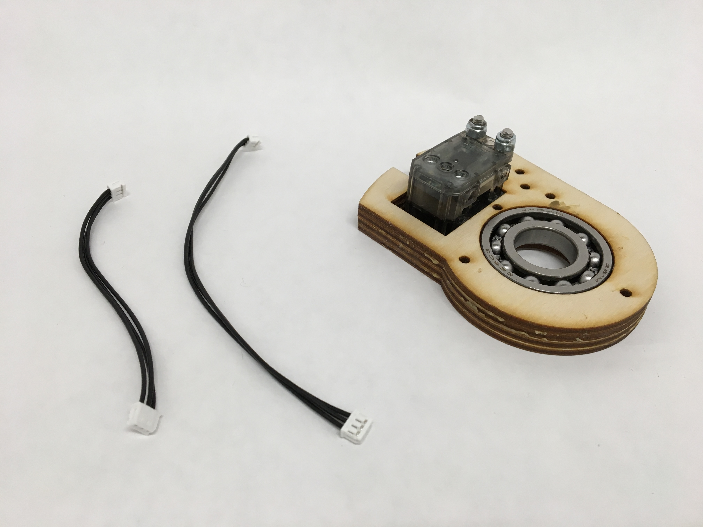
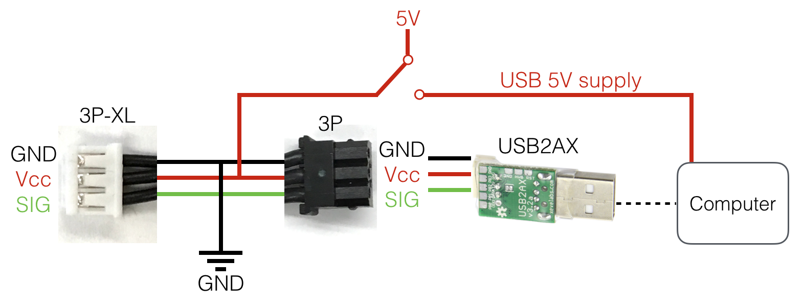

#  LICA - Social Robotics Platform

<p align="center">
  
  
  
  
  
</p>

<p align="center">
  
</p>

> **LICA** is an open-source social robotics platform designed for researchers, developers, and robotics enthusiasts. Built with a focus on accessibility and customization, LICA enables anyone to create, build, and program their own interactive social robots.

---

## About LICA

LICA is a next-generation social robotics platform that combines open-hardware principles with modern software development practices. Inspired by the successful Cornell LICA Robot project, LICA provides a comprehensive toolkit for creating expressive, interactive robotic companions.

### Key Philosophy

- **Open Source First** — All designs, code, and documentation are freely available
- **Accessibility** — Built for researchers, makers, and developers of all skill levels
- **Customization** — Modular architecture allows endless modifications
- **Community Driven** — Continuous improvement through community contributions

---

## Features

### Core Robot Control

| Feature | Description |
|---------|-------------|
| **CLI Interface** | Command-line control for gesture sequences and robot behaviors |
| **Web Dashboard** | Intuitive web-based control panel accessible via localhost or network IP (port 8000) |
| **REST API** | Programmatic control for integration with other systems |
| **Real-time Monitoring** | Live status updates and diagnostics |

### Mobile Integration

| Feature | Description |
|---------|-------------|
| **Motion Control** | Control robot orientation (pitch, yaw, roll) using smartphone sensors |
| **Gesture Mapping** | Map phone movements to robot actions |
| **Remote Operation** | Control your robot from anywhere |

### Content Creation

| Feature | Description |
|---------|-------------|
| **Visual Choreographer** | Blockly-based tool for creating complex gesture sequences |
| **Reaction System** | Build robots that respond to videos and audio |
| **Timeline Editor** | Fine-tune timing and synchronization |

### Technical Features

| Feature | Description |
|---------|-------------|
| **Multi-threading Support** | Smooth concurrent operations |
| **Gesture Library** | Pre-built movements and expressions |
| **Adjustable Parameters** | Speed, amplitude, and posture controls |
| **Sequence Programming** | Create complex behavioral patterns |

---

## Tech Stack

| Category | Technology |
|----------|------------|
| **Primary Language** | Python 3.x |
| **Web Framework** | JavaScript / HTML5 |
| **Mobile** | Native App (iOS/Android) |
| **Hardware** | Raspberry Pi / Arduino |
| **Communication** | WebSocket, REST API |
| **Motion Planning** | Custom Gesture System |

---

## Hardware Assembly

<p align="center">
  
  
</p>

### Components Overview

```
LICA Robot Assembly
================================================================================
  +---------+      +---------+      +---------+      +---------+
  |  Head   |      |  Ears   |      |  Tower  |      |  Base   |
  |  Unit   |<--->|  Unit   |<--->|  Unit   |<--->|  Unit   |
  +---------+      +---------+      +---------+      +---------+
       |                |                |                |
       +----------------+----------------+----------------+
                         Motors
================================================================================
```

---

## Getting Started

### Prerequisites

- Python 3.6 or higher
- pip3 package manager
- Linux-based OS (Raspberry Pi OS recommended)
- Git

### Installation

```bash
# Clone the repository
git clone https://github.com/maderdordor/LICA.git
cd LICA

# Install dependencies
pip3 install -r requirements.txt

# Run the web interface
python3 -m src.web_server
```

### Hardware Requirements

| Component | Specification |
|-----------|---------------|
| **SBC** | Raspberry Pi 3/4 recommended |
| **Motors** | MG996R or equivalent servo motors |
| **Power** | 5V, 3A minimum |
| **Structure** | 3D printed or laser-cut components |

---

## Project Structure

```
LICA/
├── src/                    # Source code
│   ├── core/              # Core robot control
│   ├── web_server/        # Web interface
│   └── api/               # REST API endpoints
├── lica_web/              # Web dashboard
├── lica_blockly/          # Visual choreographer (Blockly)
├── lica_app/              # Mobile application (iOS/Android)
├── assembly/              # Hardware designs & assembly guides
│   ├── gluing/           # Gluing instructions
│   ├── motor/            # Motor assembly
│   └── *.png/*.jpg       # Assembly diagrams
├── docs/                  # Documentation
└── examples/              # Sample gestures and sequences
```

---

## Documentation

For detailed guides and documentation, please visit our [Wiki](https://github.com/maderdordor/LICA/wiki).

### Available Guides

- Hardware Assembly Guide
- Software Installation
- API Reference
- Gesture Programming Tutorial
- Troubleshooting FAQ

---

## Research & Citation

If you use LICA in your research, please cite:

```bibtex
@article{lica2024,
  title={LICA: An Open-Source Social Robotics Platform},
  author={LICA Development Team},
  year={2024},
  journal={Open Robotics},
  doi={10.5281/zenodo.XXXXX}
}
```

Based on principles from the Cornell LICA Robot project:

> Michael Suguitan and Guy Hoffman. 2019. LICA: A Handcrafted Open-Source Robot. J. Hum.-Robot Interact. 8, 1, Article 2 (March 2019), 27 pages. https://doi.org/10.1145/3310356

---

## Contributing

We welcome contributions from the community! Please see our [Contributing Guidelines](CONTRIBUTING.md) for more information.

### How to Contribute

```
1. Fork the repository
      |
      v
2. Create a feature branch
      |
      v
3. Commit your changes
      |
      v
4. Push to the branch
      |
      v
5. Open a Pull Request
```

---

## License

This project is licensed under the MIT License — see the [LICENSE](LICENSE) file for details.

---

## Acknowledgments

<p align="center">
  
</p>

- Inspired by the [Cornell LICA Robot](https://github.com/omnimasudo/blossom-public) project
- Built by the robotics community, for the robotics community
- Special thanks to all contributors

---

<p align="center">
  <strong>LICA</strong> — Building the future of social robotics, one robot at a time.
</p>

<p align="center">
  <a href="https://github.com/maderdordor/LICA/stargazers">
    
  </a>
  <a href="https://github.com/maderdordor/LICA/network/members">
    
  </a>
  <a href="https://github.com/maderdordor/LICA/issues">
    
  </a>
</p>
