## LICA Roadmap — Where We're Headed

### Overview

LICA's development follows a phased roadmap designed to progressively expand the robot's capabilities—from a foundational research platform to a full-featured, community-driven ecosystem for autism education and beyond.

---

#### Phase 1 — Foundation (Completed)
The first phase established LICA's core infrastructure: a Python-based motion engine, a web-based dashboard for real-time control, and a REST API for programmatic access. This phase delivered the essential building blocks that make LICA controllable, customizable, and reproducible.

#### Phase 2 — Intelligence (Currently Active)
The active development phase focuses on enhancing LICA's perceptive and expressive capabilities. Key initiatives include AI-driven gesture recognition, voice interaction, and emotion detection—enabling LICA to respond not just to commands, but to the emotional states and engagement levels of its users. This phase is critical for making LICA a truly responsive companion for children with autism.

  

#### Phase 3 — Community (Next Milestone)
The next phase shifts focus from technical development to ecosystem growth. Plans include a gesture marketplace for sharing custom movements, a plugin architecture for extending functionality, and multi-robot coordination capabilities. This transforms LICA from a single-robot platform into a collaborative tool that educators and researchers can adapt and share.

#### Phase 4 — Scale (Long-term Vision)
The final phase envisions LICA reaching global scale through a turnkey hardware kit, an enterprise SDK for commercial integration, and international deployment initiatives. The goal is to make LICA accessible to schools, therapy centers, and families worldwide—not just research labs.

---

### Core Technology Pillars

Underpinning all four phases are three foundational pillars:

| Hardware | Software | Interfaces |
|---|---|---|
| Raspberry Pi + Arduino | Python 3.x engine | Web dashboard |
| Servo MG996R motors | Blockly visual choreographer | Mobile app (iOS/Android) |
| 3D-printed body | WebSocket + REST API | CLI control |

---

### Open Source Commitment

Every phase of LICA's development remains committed to the MIT open-source license. This ensures that the platform stays free, transparent, and community-driven—empowering researchers, educators, and makers to build upon and contribute to LICA's evolution without barriers.
